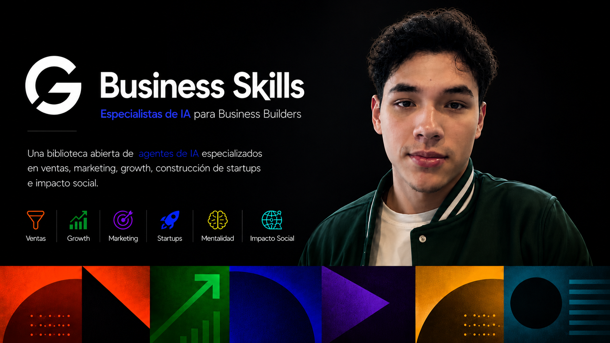

  

# Business Skills

**Una biblioteca abierta de agentes de IA especializados en negocio, ventas, contenido, growth e impacto social — en español.**

# Business Skills

**Una biblioteca abierta de 21 agentes de IA especializados en negocio, ventas, contenido, growth e impacto social — en español.**

Cada agente es un **prompt de sistema listo para pegar** + un **cuerpo de conocimiento destilado** de podcasts, cursos y charlas de gente que ya construyó cosas grandes. La idea: en vez de un asistente genérico, tienes un **equipo** de especialistas que puedes activar según la tarea.

> Inspirado en bibliotecas de skills como [`mattpocock/skills`](https://github.com/mattpocock/skills) y [`coreyhaines31/marketingskills`](https://github.com/coreyhaines31/marketingskills). Este repo lleva la misma idea al mundo de **negocio en español**.

---

## ¿Cómo se usa?

Cada carpeta en `skills/` es un agente con dos archivos:

- **`SKILL.md`** — el prompt de sistema (con frontmatter `name`/`description`, compatible con instaladores de skills tipo agentskills).
- **`conocimiento.md`** — el conocimiento destilado que da profundidad al agente.

**Activación manual (la más simple):**
1. Abre un chat o Proyecto nuevo en tu herramienta de IA favorita.
2. Pega el contenido del `SKILL.md` del agente que necesites.
3. (Opcional) Pega también su `conocimiento.md` para más contexto.
4. Di *"Adopta esta personalidad"* y empieza a trabajar.

**Encadenar agentes:** consulta [`docs/00_MANUAL_EQUIPO.md`](docs/00_MANUAL_EQUIPO.md) para los flujos (qué agente abre primero, qué le pasas al siguiente) y [`docs/GRAFO_RELACIONES.md`](docs/GRAFO_RELACIONES.md) para ver el mapa de relaciones.

---

## El equipo (21 agentes)

### 🟦 Ventas con IA
- **arquitecto-de-embudo-ia** — diseña el embudo con IA, metas y métricas; qué automatiza la IA y dónde entra el humano.
- **ingeniero-de-contactabilidad** — contact rate, cadencias, horarios, telefonía y setup de agentes de voz.
- **redactor-conversacional** — los prompts del agente de ventas (saludo, calificación, cierre).
- **maquina-de-contenido-y-clipping** — el contenido orgánico como canal de adquisición predecible.

### 🟩 Impacto social
- **arquitecto-de-modelos-autosostenibles** — la unidad replicable que "se paga sola", escuchando al usuario.
- **estratega-de-fundraising-y-acceso** — recursos, acceso a decisores y convertir el "no" en "sí".
- **estratega-de-narrativa-e-incidencia** — desestigmatización, comunicación de causa y política pública.

### 🟪 Construcción y escalamiento
- **estratega-de-fundamentos-de-startup** — la base de YC "How to Start a Startup" (17 clases destiladas): idea, producto, equipo, ejecución, growth, competencia, fundraising, cultura, enterprise, mindset del fundador, gestión, entrevistas a usuarios y mecánica legal/financiera.
- **arquitecto-de-capacidad-de-ventas** — construir la organización de ventas.
- **reclutador-de-estrellas** — reclutamiento como palanca #1; fichar star performers.
- **estratega-competitivo** — entender el mercado mejor que nadie y ganar en winner-take-all.

### 🟧 Marketing, contenido y growth
- **estratega-de-reels-virales-que-venden** — contenido corto que se hace viral Y vende.
- **editor-y-productor-de-contenido-corto** — grabar y editar con máxima retención y mínima fricción.
- **estratega-de-creatividad-y-originalidad** — generar ideas originales curando referencias.
- **estratega-de-growth-y-experimentacion** — A/B testing con rigor, priorización ICE y playbook de experimentos.
- **estratega-de-paid-ads** — adquisición pagada (Google/Meta/LinkedIn/TikTok/X): campañas, creative por ángulos y optimización CPA/ROAS.

### 🟨 Mentalidad, comunicación y venta
- **estratega-de-venta-con-proposito** — vender emoción y propósito; de admiración a obsesión.
- **coach-de-mentalidad-de-alto-rendimiento** — romper creencias, imparabilidad, entorno de alto rendimiento.
- **coach-de-comunicacion-de-alto-impacto** — entrega verbal y presencia (el *cómo se dice*).

### 🟫 Productividad con IA
- **estratega-de-productividad-agentica** — pensar en modo agéntico, orquestar agentes, "el contexto es todo".
- **formador-y-coach-de-adopcion-de-ia** — sacar del bloqueo y entrenar equipos/ejecutivos en IA.

---

## Documentos de apoyo (`docs/`)
- **`00_MANUAL_EQUIPO.md`** — roster completo y flujos de orquestación.
- **`FILOSOFIA_TRANSVERSAL.md`** — el mindset común a todo el equipo.
- **`GRAFO_RELACIONES.md`** + **`grafo_relaciones.json`** — mapa de cómo se conectan los agentes (listo para GraphRAG).
- **`REFERENCIA_Modelos_Negocio_Online.md`** y **`REFERENCIA_Marketing_Skills.md`** — bibliotecas de consulta.

## Crea tu propio agente
Usa la plantilla en [`plantilla/`](plantilla/) (`prompt.md` + `conocimiento.md`). Ver [`CONTRIBUTING.md`](CONTRIBUTING.md).

## Créditos y fuentes
Este es un trabajo de **síntesis y estudio**: el conocimiento está **destilado** de terceros y **acreditado** en [`CREDITOS.md`](CREDITOS.md). Los frameworks pertenecen a sus autores originales.

## Licencia
[MIT](LICENSE) — úsalo, modifícalo y compártelo citando la autoría. Ver también los créditos de las fuentes.
