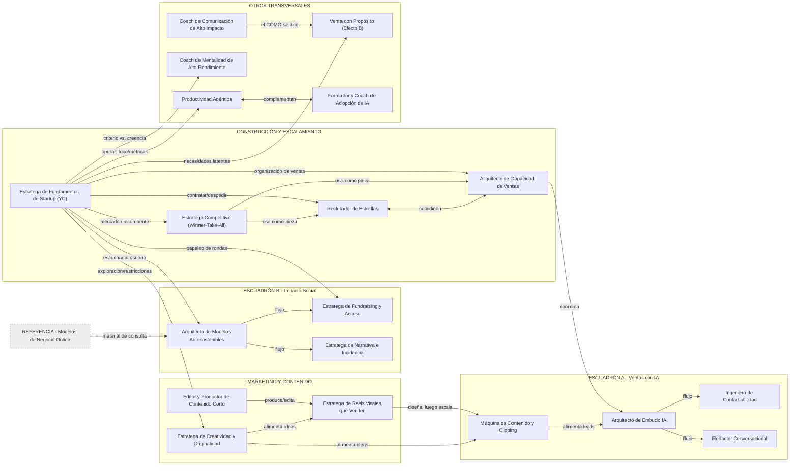

# GRAFO DE RELACIONES — SUPER EQUIPO DE AGENTES INTERNOS

> Mapa del "grafo implícito" que ya existe en el equipo, extraído de los `[[wiki-links]]` y de los cruces escritos en cada agente. Sirve como (a) mapa visual para navegar el equipo y (b) columna de aristas lista si algún día se activa **GraphRAG** (ver `grafo_relaciones.json`).
>
> **Nota de legibilidad:** los **19 agentes citan `FILOSOFIA_TRANSVERSAL`** (es la espina dorsal del mindset). Esas 19 aristas NO se dibujan aquí para no saturar el mapa; están completas en el JSON. Abajo solo se dibujan los **cruces funcionales** (los valiosos y menos obvios).

## Mapa visual

## Lectura del grafo (qué revela)

- **`FILOSOFIA_TRANSVERSAL` es el nodo más conectado** (19 aristas): es el mindset común. Cualquier motor de recuperación debería tratarlo como contexto de fondo casi siempre.
- **`Estratega de Fundamentos de Startup (YC)` es el segundo hub**: se conecta con 9 agentes. Funciona como "router" — da el marco y **deriva** al agente específico según el cuello de botella (ventas, equipo, competencia, producto, fundraising, mindset, operación).
- **Dos cadenas de producción claras:** (1) *Creatividad → Reels → Editor → Máquina de Contenido* (idea → pieza → producción → escala) y (2) *Modelos → Fundraising / Narrativa* (Escuadrón B).
- **Cluster de escalamiento comercial:** *Capacidad de Ventas ↔ Reclutador*, ambos "usados como pieza" por el *Estratega Competitivo*.

## Tipos de relación (aristas)

| Tipo | Significado |
|---|---|
| `cita_filosofia` | El agente se apoya en la filosofía transversal (mindset base) |
| `flujo` | Salida de A entra como insumo directo de B (secuencia de trabajo) |
| `alimenta` | A genera insumos (ideas, leads, evidencia) para B |
| `complementa` | A y B cubren mitades distintas de un mismo problema |
| `coordina` | Trabajan en paralelo sobre el mismo objetivo |
| `usa_como_pieza` | A orquesta a B como componente de su estrategia |
| `encadena` | A deriva/pasa el trabajo a B en una secuencia |
| `referencia` | Documento de consulta (no agente) usado por un agente |

## Cómo usar esto

1. **Hoy:** como mapa mental para saber a qué agente encadenar después de otro (handoffs del manual).
2. **Mañana (si el corpus crece):** `grafo_relaciones.json` es la capa de aristas para un **GraphRAG**; combinado con búsqueda semántica sobre los `conocimiento.md`, permite consultas de "conecta los puntos" entre dominios.
3. **Mantenimiento:** cada vez que se enriquece un agente con un nuevo cruce (`> Cruce útil: ...`), agregar la arista al JSON. Es barato y mantiene el grafo vivo.
